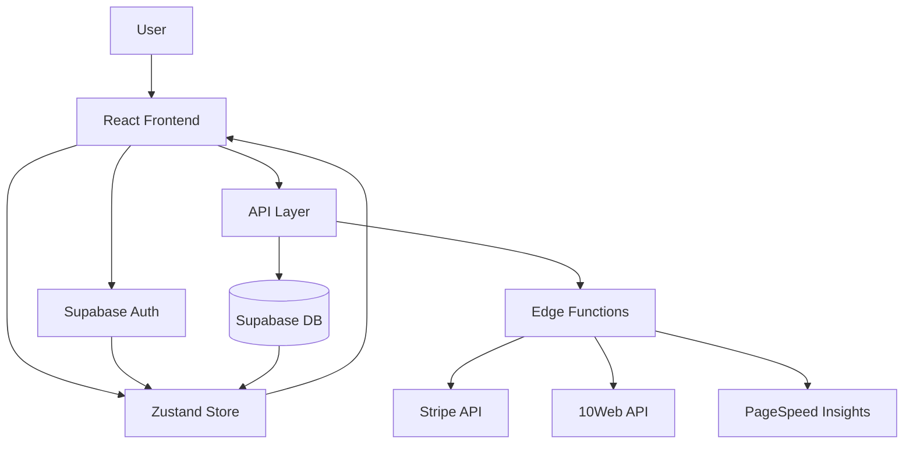

# Architecture Documentation

## System Overview

Naveeg DMS is a modern website management platform built with a clean separation of concerns and scalable architecture.

## Data Flow

### 1. Authentication Flow
1. User logs in via Supabase Auth
2. Auth state synced to Zustand store
3. User profile and websites auto-loaded
4. RLS policies enforce data access

### 2. Website Creation Flow
1. User completes onboarding wizard
2. Data stored in Zustand store
3. AI router edge function called
4. 10Web API creates website
5. Website data saved to Supabase
6. Real-time updates via subscriptions

### 3. Billing Flow
1. User selects plan
2. Billing edge function creates Stripe checkout
3. User redirected to Stripe (new tab)
4. Webhook updates subscription status
5. Store automatically refreshes user data

### 4. Analytics Flow
1. PSI edge function called with website URL
2. Google PageSpeed Insights API queried
3. Metrics processed and returned
4. Data cached for performance

## Technology Stack

### Frontend
- **React 18** - UI library
- **TypeScript** - Type safety
- **Vite** - Build tool
- **TanStack Router** - File-based routing
- **Zustand** - State management
- **TanStack Query** - Server state
- **Tailwind CSS** - Styling
- **Radix UI** - Accessible components

### Backend
- **Supabase** - Backend-as-a-Service
- **PostgreSQL** - Database
- **Edge Functions** - Serverless functions
- **Row Level Security** - Data access control

### External APIs
- **Stripe** - Payment processing
- **10Web** - Website creation
- **Google PSI** - Performance metrics

## Security Considerations

### Authentication
- JWT-based authentication via Supabase
- Secure session management
- Automatic token refresh

### Authorization
- Row Level Security (RLS) policies
- User-scoped data access
- Service role for admin operations

### API Security
- CORS configuration
- Request validation with Zod schemas
- Rate limiting (via Supabase)
- Environment variable validation

### Data Protection
- Encrypted data at rest
- HTTPS everywhere
- Audit logging for sensitive operations

## Performance Optimizations

### Frontend
- Code splitting with Vite
- React.lazy for route-level splitting
- Query caching with TanStack Query
- Optimistic updates where appropriate

### Backend
- Database indexing on common queries
- Connection pooling via Supabase
- Edge function caching
- Efficient RLS policies

### Monitoring
- Structured logging in edge functions
- Error boundaries in React
- API audit trail
- Performance metrics collection